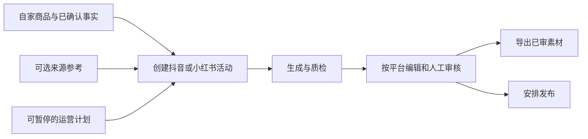

# 商品影棚

[](https://github.com/asifours-blip/shangpin-yingpeng/actions/workflows/ci.yml)

商品内容运营常被拆在来源、商品资料、内容生成、审核和交付几个入口里：参考内容容易被误写成自家商品卖点，修改后的内容可能沿用旧批准，定时或发布任务失败后也容易被重复提交。商品影棚把这些环节接成一条可追踪的工作流，给运营人员一个明确的下一步，同时保留人工审核和外部连接边界。

仓库保留可审阅的前后端应用、迁移、部署入口与测试，展示从商品事实到人工审核和素材交付的完整实现。

## 运营人员怎么用



1. 在商品库录入自家商品、主图和已确认事实。来源未连接时仍可创建活动；来源只供创作参考，不自动变成商品事实。
2. 选择目标平台、创作方向和以**模型调用次数**计的预算，启动生成。详情按平台展示执行进度、媒体、文案、事实引用与质检阻塞；一侧失败不妨碍处理另一侧已完成内容。
3. 编辑或更换媒体后审核新版本。当前版本批准后可导出素材，或进入发布安排。**导出不等于已发布**；没有发布连接与权限时仍可交付已审素材。
4. 运营计划可按时间创建草稿或推进到**待人工审核**，但不会自动批准或发布。计划可暂停；来源与商品没有明确关联规则时等待人工选择，错过的轮次由人明确补跑。

逐步操作见[运营指南](docs/operator-guide.md)。

## 本地隔离流程画面

以下画面使用**合成演示数据**，来自公开副本的本地浏览器操作，不代表真实平台连接或发布。实际走过的路径是运营总览 → 活动详情 → 编辑抖音内容至 v3、局部重做与人工审核 → 下载 `campaign-1-douyin-v3.zip`（257,683 B）；素材交付不等于发布。

| 运营总览 | 活动详情 | 已审素材交付 |
| --- | --- | --- |
|  |  |  |

窄屏对照：[运营总览](docs/screenshots/public-flow-overview-narrow.png) · [活动详情](docs/screenshots/public-flow-detail-narrow.png) · [素材交付](docs/screenshots/public-flow-delivery-narrow.png)。本轮 390 px 检查未见横向溢出、外部请求或页面/API 错误；证据范围见[验证记录](docs/verification.md)。

## 三个工程取舍

| 场景 | 实现中的判断 | 可核查位置 |
| --- | --- | --- |
| 定时任务跨进程竞争 | 计划与执行记录按固定顺序加锁；等待锁之后重新读取数据库时间、令牌、状态和租约。失去领取权的采集结果不挂到计划轮次，也不自动补跑过期窗口。 | [租约实现](backend/app/services/operation_plans.py) · [跨到期并发测试](backend/tests/test_operation_plan_lease_wait.py) |
| 审核后的素材交付 | 按活动当前平台版本锁定有效审核及资产描述，结束短事务后读取对象、生成有序 ZIP 与 SHA-256 清单。编辑并发发生时不把新旧版本混进一个包。 | [导出实现](backend/app/services/delivery.py) · [版本/并发测试](backend/tests/test_delivery.py) |
| 发布接口结果未知 | 抖音封面、视频、创建分阶段记录确认结果；超时或无法确认的响应进入 `publish_unknown`，保留请求与阶段信息，不把未知结果当失败后自动重提，也不把创建受理当作公开发布。 | [任务状态机](backend/app/services/publish_jobs.py) · [HTTP 契约测试](backend/tests/test_douyin_http.py) · [阶段恢复测试](backend/tests/test_douyin_stages.py) |

设计取舍、代码与测试的对应关系见[工程案例](docs/engineering-cases.md)。

## 本机验证状态

2026-09-28，在全新隔离空库迁移到 `0014_operation_plans` 后，完整后端套件结果为 **267 passed、0 failed、0 skipped、2 warnings**，退出码 0、用时 86.82 秒，JUnit 结果一致；此前的定向检查为 36 passed、0 skipped。首次完整执行曾有 17 项因空模型标记触发 Mock 业务门禁而失败，修正隔离测试配置后重跑全绿，未修改业务代码。公开源码前端 `npm run build` 退出码 0，Vite 处理 1683 个模块。

远端 [CI 运行 36376495278](https://github.com/asifours-blip/shangpin-yingpeng/actions/runs/36376495278) 已在提交 [`515d1ef`](https://github.com/asifours-blip/shangpin-yingpeng/commit/515d1efeceecb0097cd534cce0b71531eeae9b8f) 成功：后端 267 passed、0 skipped、2 warnings，前端构建 1683 个模块、退出码 0。上方徽章动态显示 `main` 的最新工作流状态；这次成功只对应所链接的提交。命令、条件和范围见[验证记录](docs/verification.md)，真实平台联调仍待完成。

## 项目职责与协作

项目负责人统筹需求与业务流程、实现组织、代码审查、隔离验证和交付；研发过程中与 Agent 协作完成实现。

## 已实现与待连接

这是从原项目显式筛选的**独立代码快照**，不含原私有仓库历史、培训资料或历史运行数据。应用包含 Vue 3、Vite、Element Plus 前端，以及 FastAPI、SQLAlchemy、Alembic、PostgreSQL、Redis、MinIO 后端。商品事实版本、双平台活动、生成流水线、人工版本审核、已审素材导出、发布安排、抖音 HTTP 分阶段上传/创建及可暂停的运营计划有源码和测试入口。原有生图工作台仍保留。

真实来源、模型、抖音 OAuth 与平台上传/创建、公开发布结果尚未完成真实平台联调；小红书服务端发布待接入。缺少连接时应显示待连接，不伪造榜单、账号、内容或效果数据。公开快照替换了来源不明的营销模板与测试媒体，原私有项目的历史测试结果不作为此快照的验证成绩。

## 本地隔离起步

需要 PowerShell 7.4+ 和 Docker Compose v2。先核对端口、持久卷和秘密文件位置；只在隔离本机、空数据库场景下从仓库根目录执行：

```powershell
./deploy/stack.ps1 init
# 检查 deploy/stack.env 和 deploy/secrets/；不要提交或公开实际秘密。
./deploy/stack.ps1 up
./deploy/stack.ps1 smoke
```

`init` 只补齐缺失文件，不覆盖已有配置。空库 `up` 迁移至 `0014_operation_plans`；不要把已有数据库当空库试探升级。`smoke` 只检查依赖、schema 和前端入口，不证明业务流程或外部连接通过。完整前提见[部署说明](docs/deployment.md)，源码开发见[前端](frontend/README.md)与[后端](backend/README.md)。

**不要公网部署此快照。**空用户库启动会自动建立固定演示账号，`APP_ENV=production` 也不会跳过。发布与 OAuth 开关在本地 Compose 固定关闭，模型密钥未注入；生成、生图、发布 Worker 和计划调度器默认关闭。安全初始化、权限、HTTPS、秘密管理及真实上游验收仍需完成。快照没有原私有 0013→0014 升级所需的旧发布提交与备份，不提供可复演的历史升级步骤。

本项目**不提供通用开源许可证**。作者仅对自己有权的部分保留权利，不排除 GitHub 平台条款赋予的查看/fork 权利或法律例外；见[权利说明](RIGHTS.md)与[第三方说明](THIRD_PARTY_NOTICES.md)。Inter 字体保留 OFL；未核实再分发权的第三方展示视频及海报不在此快照中。[初次公开快照清单](PUBLIC_EXPORT_MANIFEST.json)对应公开根提交 `60d048d`，其文件哈希**不覆盖后续修改**。
