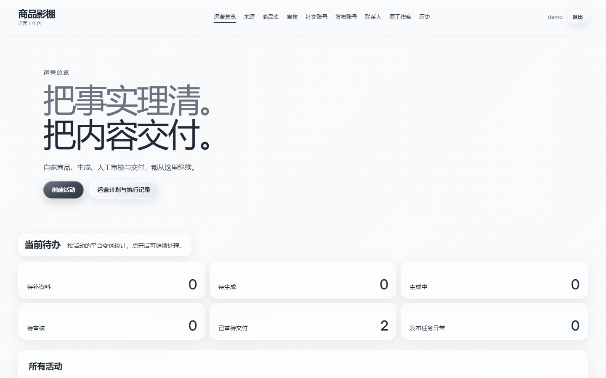
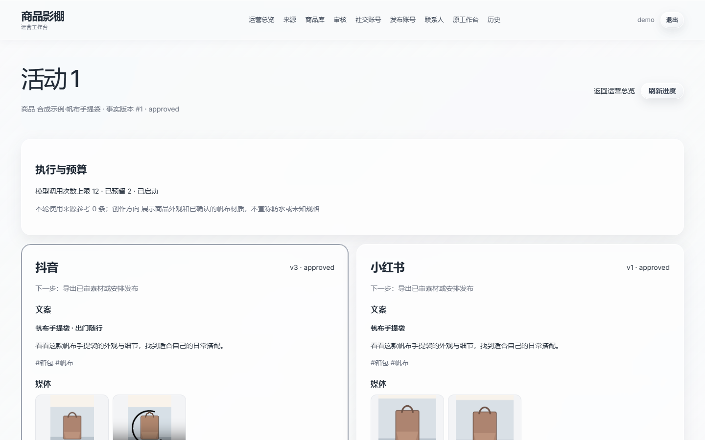
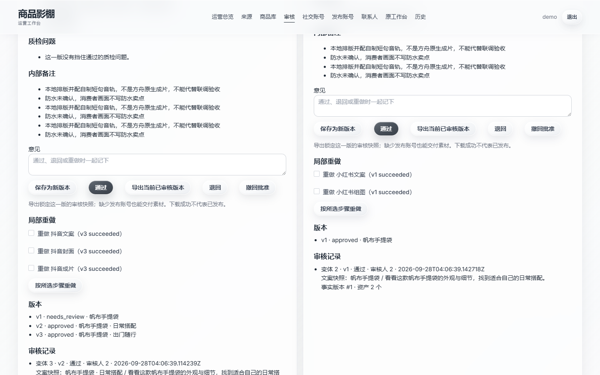
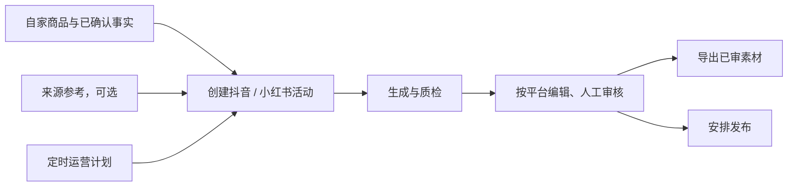

# 商品影棚

[](https://github.com/asifours-blip/shangpin-yingpeng/actions/workflows/ci.yml)

一个给电商内容运营用的工作台：从自家商品资料出发，生成抖音、小红书的图文和视频内容，经过人工审核后导出素材或安排发布。

做内容运营时，常见的几个坑是：竞品的参考文案被误写成自家商品的卖点；内容改过之后，还在沿用改之前拿到的审批；发布接口超时后被重复提交。商品影棚把"商品事实 → 生成 → 质检 → 审核 → 交付"接成一条可追踪的流程，每一步都有明确的下一步，关键节点由人来把关。

| 运营总览 | 活动详情 | 已审素材交付 |
| --- | --- | --- |
|  |  |  |

截图使用的是合成演示数据，也有[窄屏版本](docs/screenshots/public-flow-overview-narrow.png)。

## 运营人员怎么用



- **商品事实和参考素材分开管理。** 来源内容只作为创作参考，不会自动变成商品的卖点。
- **预算按模型调用次数设定。** 一个平台生成失败，不影响另一个平台已经完成的内容。
- **审批跟着版本走。** 内容改过之后要重新审核，导出的一定是当前被批准的那个版本。
- **定时计划只会推进到"待人工审核"。** 不会自动批准，也不会自动发布；计划可以随时暂停。

详细操作见[运营指南](docs/operator-guide.md)。

## 几个值得一说的设计

**定时任务不会被两个进程同时领走。** 计划和执行记录按固定顺序加锁；拿到锁之后，重新读一遍数据库里的时间、令牌、状态和租约，再决定要不要执行。失去领取权的那一方，结果会被丢弃，不会挂到计划上。（[实现](backend/app/services/operation_plans.py) · [并发测试](backend/tests/test_operation_plan_lease_wait.py)）

**导出的素材包不会混进新旧两个版本。** 导出时先锁定当前平台版本的有效审批和素材清单，再打包成 ZIP，并附上 SHA-256 清单。导出过程中即使有人在编辑，也不会把改了一半的内容打进包里。（[实现](backend/app/services/delivery.py) · [测试](backend/tests/test_delivery.py)）

**发布结果不确定，就标记为不确定。** 抖音的封面上传、视频上传、作品创建分阶段记录。超时或无法确认的响应进入"结果未知"状态，保留请求和阶段信息，不当作失败自动重发，也不把"平台已受理"当成"已公开发布"。（[状态机](backend/app/services/publish_jobs.py) · [契约测试](backend/tests/test_douyin_http.py)）

**视频可以按镜头逐个审核。** 除了原来的整条视频流程，还可以选择三镜头模式：先审首帧，再审每个镜头的视频，满意就锁定；想改某一镜，必须先解锁，只重做这一个，另外两个不受影响。重做前会检查预算是否够用，前一次任务还在进行或结果未知时不允许重做，避免重复扣费。这个模式导出的是带哈希清单的素材包，没有拼成成片，所以不能排期发布。（[验收记录](docs/storyboard-verification.md)）

更多取舍和代码、测试的对应关系见[工程案例](docs/engineering-cases.md)。

## 技术栈

Vue 3 + Vite + Element Plus · FastAPI · SQLAlchemy / Alembic · PostgreSQL · Redis · MinIO · Docker Compose · pytest · GitHub Actions

## 本地运行

需要 PowerShell 7.4+ 和 Docker Compose v2，并且要在一个隔离的本机环境、空数据库上运行：

```powershell
./deploy/stack.ps1 init    # 补齐配置文件，不会覆盖已有配置
./deploy/stack.ps1 up
./deploy/stack.ps1 smoke
```

本地环境默认关闭模型、发布和定时调度，不需要任何密钥。部署细节见[部署说明](docs/deployment.md)，前后端开发见 [frontend](frontend/README.md) 和 [backend](backend/README.md)，测试范围和结果见[验证记录](docs/verification.md)。

## 目前的边界

- 真实的来源平台、模型服务和抖音开放平台还没有完成联调；小红书的服务端发布尚未接入。没有接入的部分在界面上会显示为"待连接"，不会用假数据代替。
- 这是从原项目整理出来的公开快照，不包含原私有仓库的历史和运行数据。
- 空库启动时会自动创建演示账号，**请不要把这份快照部署到公网**。

## 关于这个项目

需求分析、业务流程设计、代码审查和验证由我负责，编码过程中使用 AI 编程助手协作完成。

本仓库**不提供开源许可证**，仅公开源码供查看，详见[权利说明](RIGHTS.md)和[第三方说明](THIRD_PARTY_NOTICES.md)。
